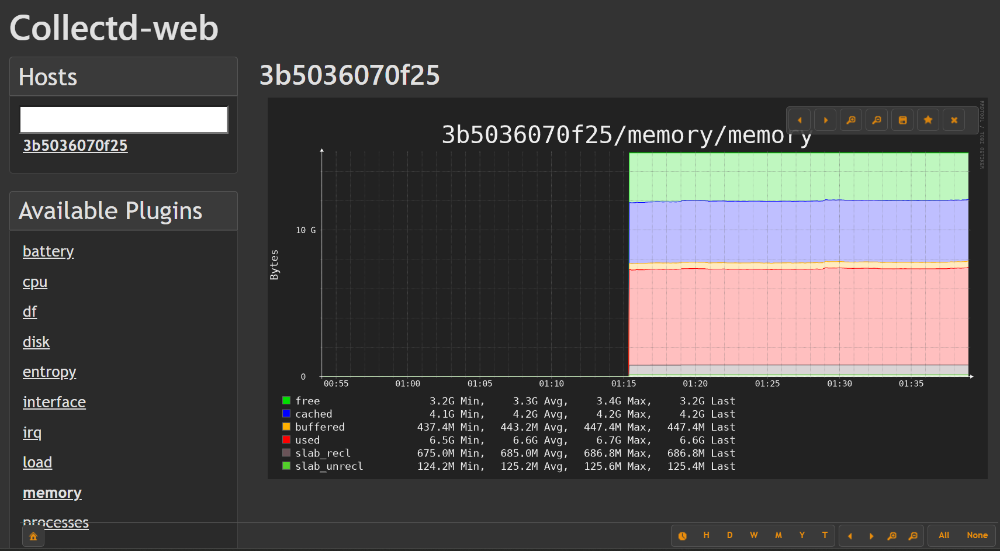

# Collectd-web: A User-Friendly Interface for Collectd

[](code_of_conduct.md)

Collectd-web provides a sleek, intuitive, and customizable web interface for Collectd – the robust resource monitoring tool. Originally, Collectd’s bundled frontend was designed only for testing, leaving its full potential untapped. Collectd-web bridges that gap by offering an efficient, user-centered experience for monitoring system statistics.

## 📊 Table of Contents

- [🚀 Features](#-features)
- [🛠 Installation](#-installation)
  - [Prerequisites](#prerequisites)
  - [Configuration](#configuration)
  - [Debian-based Installation](#debian-based-installation)
- [🌐 Usage](#-usage)
- [🔗 Links](#-links)
- [📄 License](#-license)
- [💰 Funding](#-funding)
- [📝 Contributing](#-contributing)

## 🚀 Features

- **Intuitive Dashboard:** Easily visualize system statistics with a responsive design.
- **Customizable Interface:** Adjust the display to highlight the data that matters to you.
- **Quick Deployment:** Launch the built-in, standalone web server with minimal setup.
- **Efficient Monitoring:** Optimized for performance and usability in monitoring diverse systems.



## 🛠 Installation

### Prerequisites

Before installing Collectd-web, please ensure:

- **Directory Structure:**
  Organize your files so that each host’s data resides in its own sub-directory named after the host. For example:

  ```sh
  /etc/collectd/collectd-web/localhost/
  ```

- **Python 3.6+ Requirement:**
  The standalone web server requires Python version 3.6 or higher.

### Configuration

After setting up your directories, create a configuration file to define your data directory. For example, create `/etc/collectd/collection.conf` with the following content:

```sh
datadir: "/etc/collectd/collectd-web/"
```

### Debian-based Installation

To install **collectd-web**, you need to download the latest `.deb` package from the [GitHub Releases](https://github.com/httpdss/collectd-web/releases) page.

### Steps

1. **Find the Latest Release**
   Navigate to the [collectd-web Releases](https://github.com/httpdss/collectd-web/releases) page.

2. **Download the `.deb` File**
   You can manually download the latest `.deb` file from the release assets or use the following command to fetch it automatically:

   ```bash
   wget $(curl -s https://api.github.com/repos/httpdss/collectd-web/releases/latest | grep "browser_download_url.*\.deb" | cut -d '"' -f 4)
   ```

3. **Install the Package**
   Once downloaded, install it using:

   ```bash
   sudo dpkg -i collectd-web*.deb
   ```

4. **Resolve Dependencies (if needed)**
   If there are missing dependencies, run:

   ```bash
   sudo apt-get install -f
   ```

5. **Start the Service**
   Finally, start the service:

   ```bash
   sudo service collectd-web start
   ```

## 🌐 Usage

### Standalone Server

To start the Collectd-web standalone server, simply run:

```bash
sudo service collectd-web start
```

Once running, open your web browser and navigate to the provided address (typically `http://localhost:8888`) to begin monitoring your systems.

### Nginx Configuration

Check the [Nginx configuration](debian/collectd-web.nginx.conf) for setting up Collectd-web with Nginx.

### Apache Configuration

Add these lines to your apache vhost configuration:

```apache
    Alias /collectd-web/collectd-web /path/to/vhost/httdocs/collectd-web
    <Directory /path/to/vhost/httdocs/collectd-web/cgi-bin>
      Options +ExecCGI +FollowSymLinks
      AddHandler cgi-script .cgi .pl
    </Directory>
```

## 🔗 Links

- **Project Homepage:** [Collectd-web on GitHub](http://github.com/httpdss/collectd-web)
- **Code of Conduct:** Please review our [Code of Conduct](code_of_conduct.md) for community guidelines.

## 📄 License

Collectd-web is licensed under the [Apache 2.0 License](LICENSE). For full license details, please refer to the LICENSE file.

## 💰 Funding

If you find Collectd-web useful, please consider supporting its development. Donations can be made via [PayPal](https://www.paypal.me/httpdss). Your support is greatly appreciated!

## 📝 Contributing

We welcome contributions from the community. For details on how to get involved, please see our [CONTRIBUTING.md](.github/CONTRIBUTING.md).
