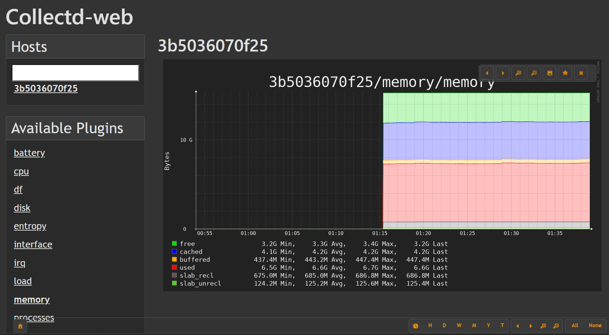

# Collectd-web: A User-Friendly Interface for Collectd

Collectd-web provides a sleek, intuitive, and customizable web interface for Collectd – the robust resource monitoring tool. Originally, Collectd's bundled frontend was designed only for testing, leaving its full potential untapped. Collectd-web bridges that gap by offering an efficient, user-centered experience for monitoring system statistics.

## 🐍 Upcoming: Python Backend Rewrite

The Perl CGI backend is being replaced with a clean **Python Flask** application. All graph functionality is preserved — just lighter, easier to deploy, and ready for community contributions.

> **[PR #168 — Python Flask backend](https://github.com/httpdss/collectd-web/pull/168)** is open for review. Feedback welcome!
>
> Key changes: removes `librrds-perl`, `libjson-perl`, `libhtml-parser-perl`, `libcgi-pm-perl`, `libipc-run-perl` — replaced by `pip install flask rrdtool`. Full pytest suite included.

## 📌 Project Status

**Maintenance mode.** Collectd-web is stable and actively maintained for bug fixes and security updates. New feature development is limited. If you depend on collectd-web, it is safe to use — just expect incremental rather than major changes going forward.

Found a bug? Please [open an issue](https://github.com/httpdss/collectd-web/issues). Have a question or want to discuss the project? Join us in [GitHub Discussions](https://github.com/httpdss/collectd-web/discussions).

## 📊 Table of Contents

- [🚀 Features](#-features)
- [🛠 Installation and Usage](#-installation-and-usage)
- [🔗 Links](#-links)
- [📄 License](#-license)
- [💰 Funding](#-funding)
- [📝 Contributing](#-contributing)

## 🚀 Features

- **Intuitive Dashboard:** Easily visualize system statistics with a responsive design.
- **Customizable Interface:** Adjust the display to highlight the data that matters to you.
- **Quick Deployment:** Launch the built-in, standalone web server with minimal setup.
- **Efficient Monitoring:** Optimized for performance and usability in monitoring diverse systems.

## 🛠 Installation and Usage

For installation, deployment, and troubleshooting details, see [docs/installation.md](docs/installation.md).

That guide covers:

- Debian / Ubuntu package install
- standalone server usage
- Nginx reverse proxy setup
- Apache CGI setup
- common graph, permission, and service startup problems

The standalone server default is `http://127.0.0.1:8888/`.

## 🔗 Links

- **Project Homepage:** [Collectd-web on GitHub](http://github.com/httpdss/collectd-web)
- **Community Discussions:** [GitHub Discussions](https://github.com/httpdss/collectd-web/discussions)
- **Code of Conduct:** Please review our [Code of Conduct](code_of_conduct.md) for community guidelines.

## 📄 License

Collectd-web is licensed under the [Apache 2.0 License](LICENSE). For full license details, please refer to the LICENSE file.

## 💰 Funding

If you find Collectd-web useful, please consider supporting its development. Donations can be made via [PayPal](https://www.paypal.me/httpdss). Your support is greatly appreciated!

## 📝 Contributing

We welcome contributions from the community. For details on how to get involved, please see our [CONTRIBUTING.md](.github/CONTRIBUTING.md).
